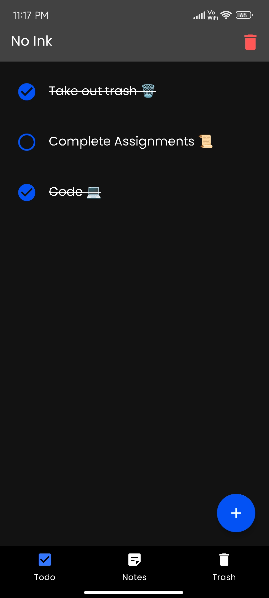
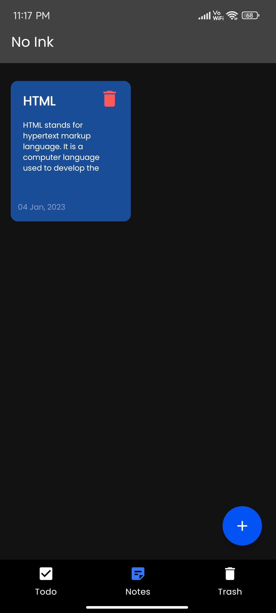

# NoInk 📝
A simple note taking and todo list app built using Kotlin.

## 🛠️ Technologies Used

- [Kotlin](https://kotlinlang.org/) - First class and official programming language for Android development.
- [Room](https://developer.android.com/jetpack/androidx/releases/room) - Room is an android library which is an ORM which wraps android's native SQLite database.
- [View Model](https://developer.android.com/topic/libraries/architecture/viewmodel) - Stores UI-related data that isn't destroyed on UI changes.
- [ViewBinding](https://developer.android.com/topic/libraries/view-binding) - View binding is a feature that allows you to more easily write code that interacts with views.
- [Live Data](https://developer.android.com/topic/libraries/architecture/livedata) -  LiveData is an observable data holder class.
- [Coroutines](https://kotlinlang.org/docs/reference/coroutines-overview.html) - For asynchronous and more.
- [Google Fonts](https://fonts.google.com) - Awesome fonts provided by Google.

## Screenshots
 

## Download
You can download the software by going to the [releases](https://github.com/thatsmanmeet/NoInk/releases/) page and from the latest release tag select `app-release.apk` to download the apk.
